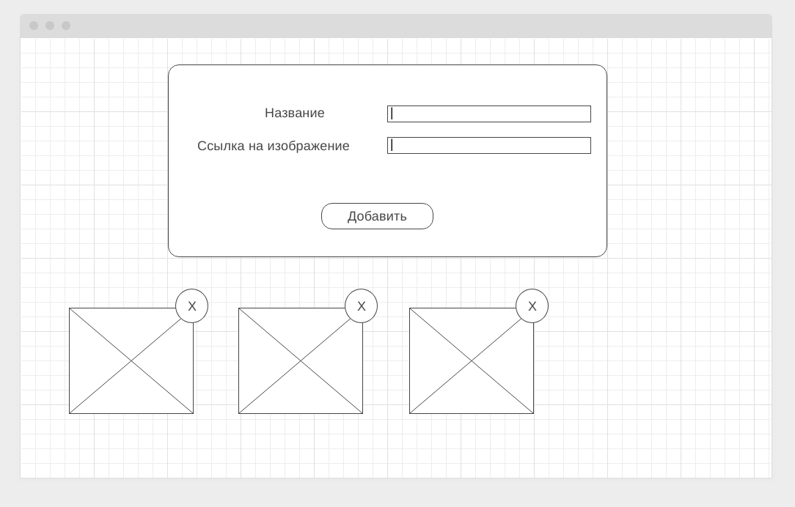

#### Домашние задания к курсу «Продвинутый JavaScript в браузере»
### 3. Events. Галерея изображений с проверкой URL (задача со звёздочкой)

Environment: https://npeplov.github.io/ahj-events--gallery/

Вам необходимо реализовать легковесный "менеджер изображений" - на самом деле это будет приложение, которое разрешает пользователю вводить "Название изображения" и "URL" к нему.

Важная достаточно вещь, Заказчик хочет, чтобы если ссылка неверная - т.е. по этой ссылке нет валидного изображения, то добавления объекта не происходило. Подумайте как это сделать. Подсказка: у вас есть механизм событий и вполне возможно, что для элемента img есть события, которые вам в этом помогут.

Важно: вам не нужно валидировать посимвольно сам URL, смотреть есть ли расширение в конце и т.д.!

#### Описание

Приложение должно выглядеть следующим образом:

Функциональность:
1. Добавлять можно как по кнопке "Добавить" так и по клавише Enter (подумайте, как это реализовать)
1. Если URL картинки валидный (т.е. там есть картинка) должно происходить создание блока (см. три блока внизу) для добавленной картинки. Соответственно, в блоке - картинка и элемент для удаления картинки
1. Если URL картинки не валидный, добавления происходить не должно, вместо этого под полем "Ссылка на изображение" должна появляться надпись "Неверный URL изображения"
1. После добавления поля должны очищаться

Старайтесь разделить своё приложение на классы, каждый из которых отвечал бы за свою часть функциональности.

Всё должно собираться через Webpack (включая картинки и стили) и выкладываться на Github Pages через CI.